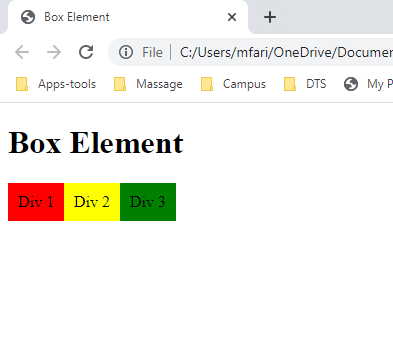
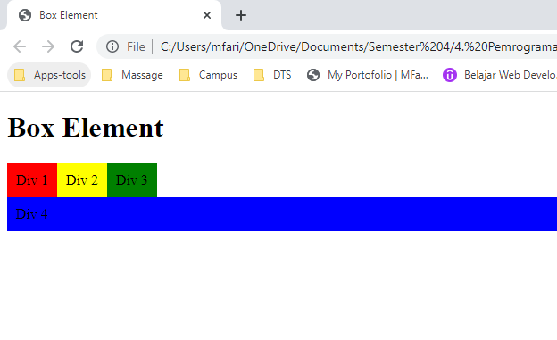
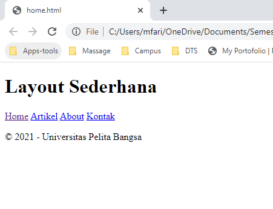
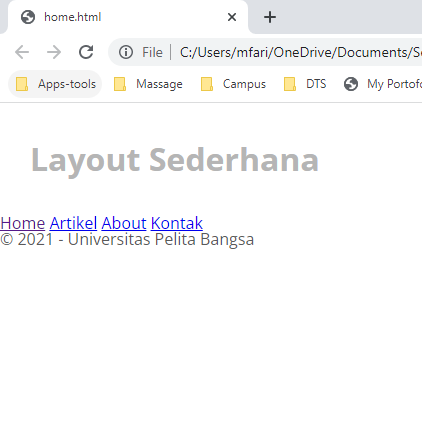
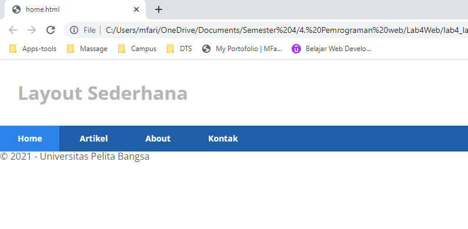

# Lab4Web

**Nama  : Mohamad Farizal Arifin**

**Nim   : 312010231**

**Kelas : TI.20.B.1**

<br>

**Langkah - langkah praktikum**<br>

1. membuat dokumen HTML dengan nama file **lab4_box.html** seperti berikut.<br>

```
<!DOCTYPE html>
<html lang="en">
<head>
    <meta charset="UTF-8">
    <meta name="viewport" content="width=device-width, initial-scale=1.0">
    <title>Box Element</title>
</head>
<body>
    <header>
        <h1>Box Element</h1>
    </header>
</body>
</html>
```
<br>

2. Membuat Box Element <br>
Kemudian tambahkan kode untuk membuat box element dengan tag div seperti berikut.<br>

```
<section>
    <div class="div1">Div 1</div>
    <div class="div2">Div 2</div>
    <div class="div3">Div 3</div>
</section>
```
<br>

3. CSS Float Property <br>
Selanjutnya tambahkan deklarasi CSS pada head untuk membuat float element, seperti berikut.<br>

```
<style>
    div {
        float:left;
        padding: 10px;
    }
    .div1 {
        background: red;
    }
    .div2 {
        background: yellow;
    }
    .div3 {
        background: green;
    }
</style>
```
<br>
Kemudian buka browser untuk melihat hasilnya. <br>
Berikut hasilnya :<br>
<br>

 <br>
<br>

4. Mengatur Clearfix Element <br>
**Clearfix** digunakan untuk mengatur element setelah float element. Property clear digunakan untuk mengaturnya.<br>
Tambahkan element div lainnya seteleah div3 seperti berikut.<br>

```
<section>
    <div class="div1">Div 1</div>
    <div class="div2">Div 2</div>
    <div class="div3">Div 3</div>
    <div class="div4">Div 4</div>
</section>
```
<br>
Kemudian atur property clear pada CSS, seperti berikut.<br>

```
.div4 {
    background-color: blue;
    clear: left;
    float: none;
}
```
<br>
Selanjutnya buka browser dan refresh kembali. <br>
<br>

 <br>
<br>
Bisa juga melakukan eksperimen terhadap penggunaan property clear dengan nilai lainnya *(left, both, right)*, dan amati perubahannya.<br>
<br>

# Membuat Layout Sederhana
<br>

Buat **folder baru** dengan nama **lab4_layout**, kemudian buatlah file baru didalamnya dengan nama **home.html**, dan file css dengan nama **style.css**.<br>

```
<!DOCTYPE html>
<html lang="en">
<header>
    <h1>Layout Sederhana</h1>
</header>
    <nav>
    <a href="home.html" class="active">Home</a>
    <a href="artikel.html">Artikel</a>
    <a href="about.html">About</a>
    <a href="kontak.html">Kontak</a>
</nav>
<section id="hero"></section>
<section id="wrapper">
    <section id="main"></section>
    <aside id="sidebar"></aside>
</section>
<footer>
    <p>&copy; 2021 - Universitas Pelita Bangsa</p>
</footer>
<body>
    <div id="container">

    </div>
</body>
</html>
```
<br>
Kemudian buka browser dan lihat hasilnya.<br>
<br>

 <br>
<br>

**Kemudian tambahkan kode CSS untuk membuat layoutnya.**

```
/* import google font */
@import
url('https://fonts.googleapis.com/css2?family=Open+Sans:ital,wght@0,300;0,400;0,600;0,700;0,800;1,300;1,400;1,600;1,700;1,800&display=swap');
@import
url('https://fonts.googleapis.com/css2?family=Open+Sans+Condensed:ital,wght@0,300;0,700;1,300&display=swap');

/* Reset CSS */
* {
    margin: 0;
    padding: 0;
}
body {
    line-height:1;
    font-size:100%;
    font-family:'Open Sans', sans-serif;
    color:#5a5a5a;
}
#container {
    width: 980px;
    margin: 0 auto;
    box-shadow: 0 0 1em #cccccc;
}

/* header */
header {
    padding: 20px;
}
header h1 {
    margin: 20px 10px;
    color: #b5b5b5;
}
```

<br>
Kemudian buka browser dan lihat hasilnya.<br>
<br>

 <br>
<br>

**Membuat Navigasi**
Kemudian selanjutnya mengatur navigasi.<br>

```
/* header */
header {
    padding: 20px;
}
header h1 {
    margin: 20px 10px;
    color: #b5b5b5;
}

/* navigasi */
nav {
    display: block;
    background-color: #1f5faa;
}
nav a {
    padding: 15px 30px;
    display: inline-block;
    color: #ffffff;
    font-size: 14px;
    text-decoration: none;
    font-weight: bold;
}
nav a.active,
nav a:hover {
    background-color: #2b83ea;
}
```
<br>
Kemudian lihat hasilnya.<br>
<br>

 <br>
<br>